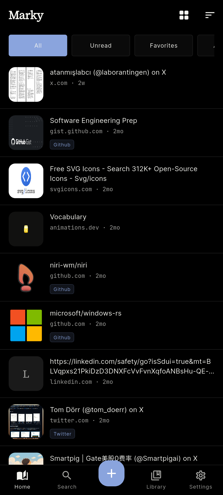
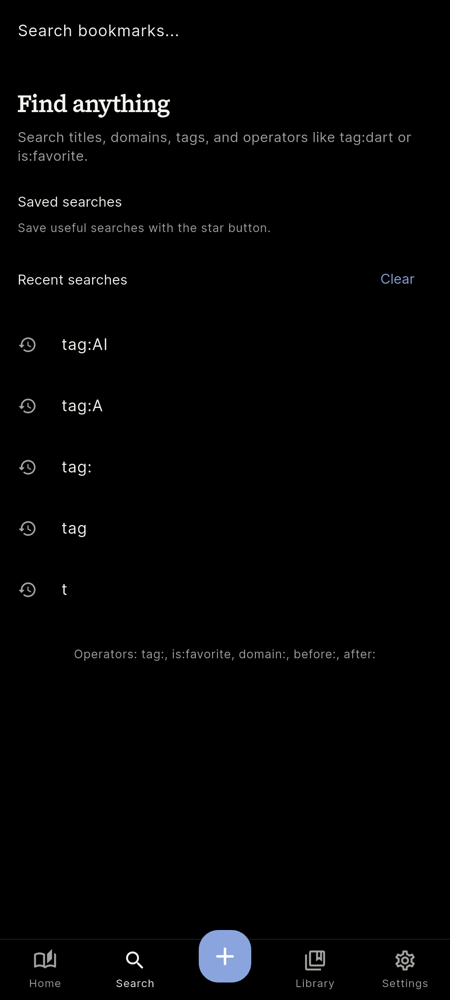
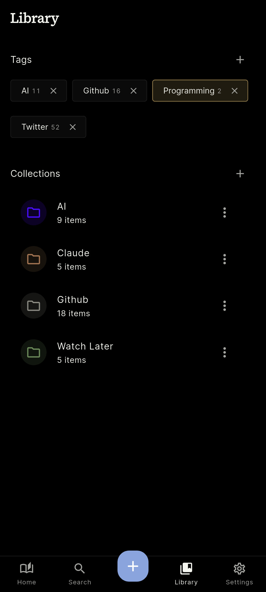
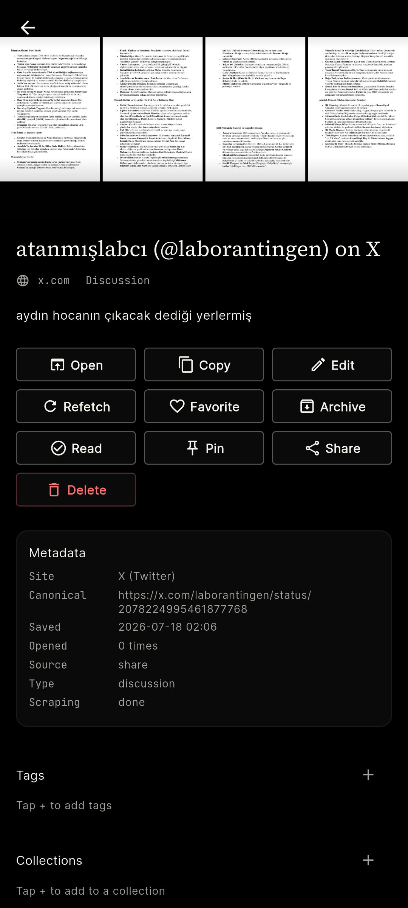
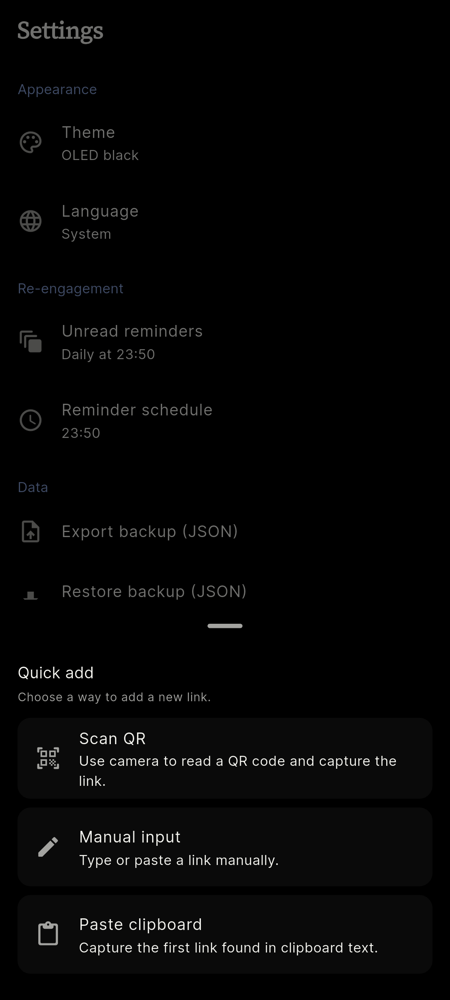
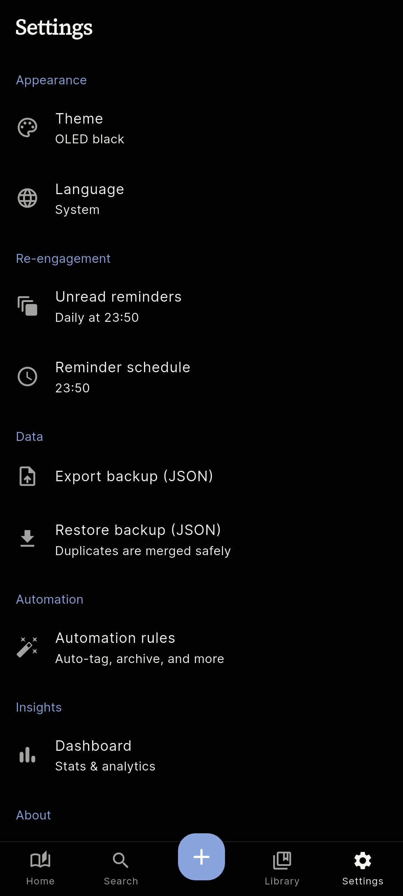

<div align="center">


# Marky

*Çevrimdışı öncelikli Android yer imi yöneticisi — bağlantılarını hızlı yakala, düzenle, hatırla.*

[][license]


-F6AB2F)


</div>

<p align="center" style="border-bottom: 3px solid #F6AB2F; width: 100%;"></p>

Bağlantılarını kaydetmek, organize etmek ve gerektiğinde yeniden bulmak için tasarlanmış, çevrimdışı öncelikli bir Android uygulamasıdır. Yer imleri, etiketler, koleksiyonlar, notlar, hatırlatıcılar ve ayarlar — hepsi cihazında, Isar ile saklanır.

Flutter ile geliştirilmiş olup karanlık tema (OLED siyah) ve hızlı yakalama akışlarıyla (panodan, QR'dan, paylaşım menüsünden) tasarlanmıştır. Verilerin cihazdan çıkmaz; sunucu yoktur.

---

<p style="border-left: 4px solid #F6AB2F; padding-left: 12px; font-size: 20px; font-weight: 700; margin-bottom: 8px;">Özellikler</p>

<table align="center">
  <tr>
    <td width="50%" align="left">
      <b>⚡ Hızlı Yakalama</b><br>
      <span style="color: #888;">Manuel giriş, panodan, QR taraması veya Android paylaşım menüsüyle tek dokunuşta kaydet.</span>
    </td>
    <td width="50%" align="left">
      <b>🔁 Tekrar Bilincinde Kütüphane</b><br>
      <span style="color: #888;">Var olan bağlantılar sessizce yeniden kaydedilmez; <code>Open</code> eylemiyle yüzeye çıkarılır.</span>
    </td>
  </tr>
  <tr>
    <td width="50%" align="left">
      <b>📂 Koleksiyonlar &amp; Etiketler</b><br>
      <span style="color: #888;">Koleksiyonlar ve etiketlerle kütüphaneni düzenle; etiket sayısı ve koleksiyon öğeleri tek bakışta.</span>
    </td>
    <td width="50%" align="left">
      <b>🔍 Güçlü Arama</b><br>
      <span style="color: #888;">Başlık, alan adı, etiket ve operatörler: <code>tag:dart</code>, <code>is:favorite</code>, <code>domain:</code>, <code>before:</code>, <code>after:</code>; kayıtlı ve son aramalar.</span>
    </td>
  </tr>
  <tr>
    <td width="50%" align="left">
      <b>🤖 Otomasyon Kuralları</b><br>
      <span style="color: #888;">Yakalamadan sonra otomatik etiketleme, arşivleme veya organize etme.</span>
    </td>
    <td width="50%" align="left">
      <b>⏰ Hatırlatıcılar</b><br>
      <span style="color: #888;">Yer imi hatırlatıcıları ve global okunmamış hatırlatıcılarıyla bağlantıları kaçırma.</span>
    </td>
  </tr>
  <tr>
    <td width="50%" align="left">
      <b>💾 Yedekleme &amp; Geri Yükleme</b><br>
      <span style="color: #888;">Yerel veriyi dışa aktar ve geri yükle — cihaz değişse bile kütüphane güvende.</span>
    </td>
    <td width="50%" align="left">
      <b>🤖 Android Entegrasyonları</b><br>
      <span style="color: #888;">Paylaşım katmanı, hızlı eylemler, başlatıcı kısayolları, QR yakalama ve ana ekran widget'ı.</span>
    </td>
  </tr>
</table>

---

<p style="border-left: 4px solid #F6AB2F; padding-left: 12px; font-size: 20px; font-weight: 700; margin-bottom: 8px;">Ekran Görüntüleri</p>

<div align="center">

| Ana Ekran | Arama | Kütüphane |
|:---------:|:------:|:---------:|
|  |  |  |

| Yer İmi Detayı | Hızlı Ekleme | Ayarlar |
|:--------------:|:------------:|:-------:|
|  |  |  |

</div>

---

<p style="border-left: 4px solid #F6AB2F; padding-left: 12px; font-size: 20px; font-weight: 700; margin-bottom: 8px;">Teknolojiler</p>

| Kategori | Paketler |
|---|---|
| Çerçeve | Flutter 3.22+, Dart 3.4+ |
| Veri | Isar (yerel, çevrimdışı öncelikli) |
| Platform | Android SDK 36, Java 17 |
| Test | flutter_test, dart_test, Maestro (UI testleri) |

---

<p style="border-left: 4px solid #F6AB2F; padding-left: 12px; font-size: 20px; font-weight: 700; margin-bottom: 8px;">Başlangıç</p>

**Gereksinimler:** Flutter `>=3.22.0`, Dart `>=3.4.0 <4.0.0`, Android SDK 36, Java 17

```bash
# 1. Bağımlılıkları kur
flutter pub get

# 2. Analiz & test
flutter analyze
flutter test

# 3. Uygulamayı çalıştır
flutter run
```

Release öncesi doğrulama kapısı:

```powershell
.\scripts\pre_release_check.ps1 -AllTests
```

Release App Bundle:

```powershell
flutter build appbundle --release
```

**Android release imzalama:** `android/key.properties` veya ortam değişkenleri ile yapılandırılır; gerçek keystore dosyaları veya kimlik bilgileri asla commit edilmez. Desteklenen değişkenler: `MARKY_STORE_FILE`, `MARKY_STORE_PASSWORD`, `MARKY_KEY_ALIAS`, `MARKY_KEY_PASSWORD`.

---

<p style="border-left: 4px solid #F6AB2F; padding-left: 12px; font-size: 20px; font-weight: 700; margin-bottom: 8px;">Proje Yapısı</p>

<details>
<summary>Kök dizin ağacı</summary>

```text
marky/
├── lib/              # Uygulama kodu (ekranlar, servisler, modeller)
├── android/          # Yerel Android katmanı (manifest, imzalama)
├── test/             # Testler
├── assets/           # Logo ve animasyonlar
├── scripts/          # Pre-release doğrulama betikleri
├── tools/            # Geliştirme araçları
└── screenshots/      # README ekran görüntüleri
```

</details>

---

<div align="center">

## Lisans

[MIT](LICENSE) — © 2026 Vyr0

</div>

[license]: LICENSE
